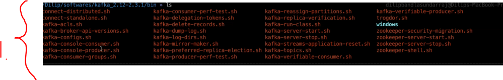

# Section 04: Download and Install Kafka.

Download and Install Kafka.

# What I learned.

# Download and Install Kafka.

- [Kafka](https://kafka.apache.org/downloads) source link.
    - I downloaded the version `kafka_2.12-2.3.1`.
        - This included the **ZooKeeper**!

- These folders come from the **Kafka**, once downloaded.

    

1. We can produce entries to the topic using these scripts.

> [!IMPORTANT]
> Notice the **ZooKeepper** is completely removed it from some versions!