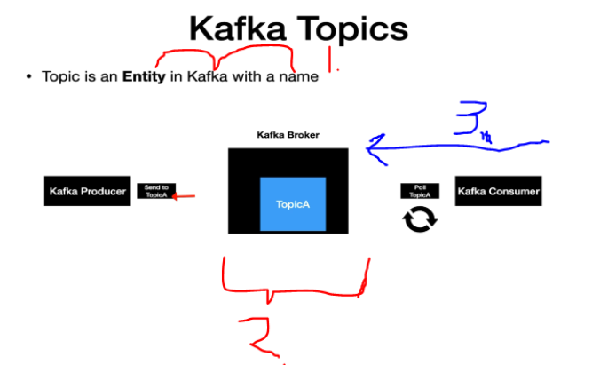
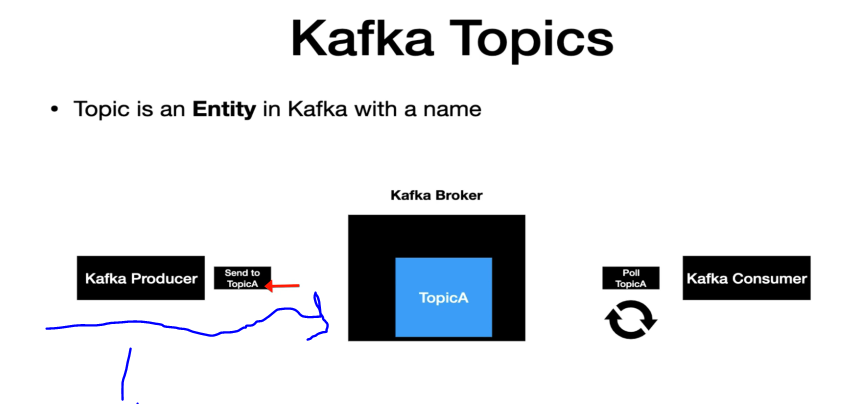
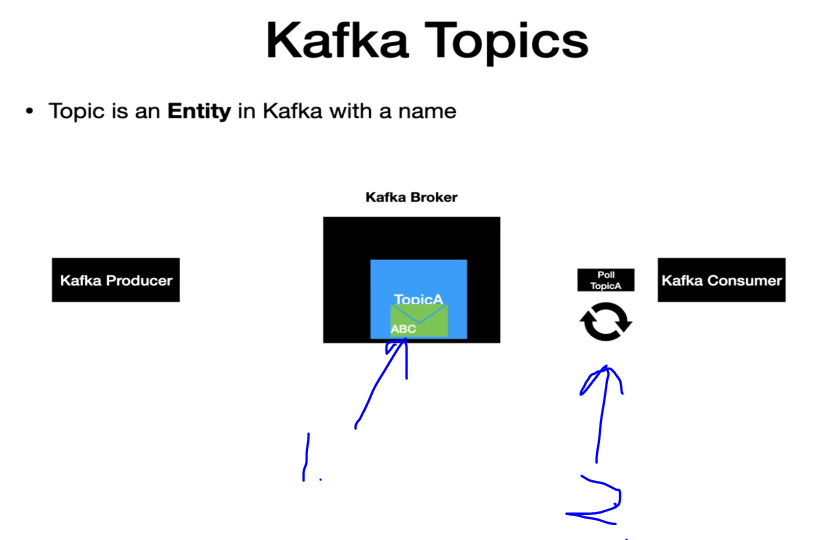
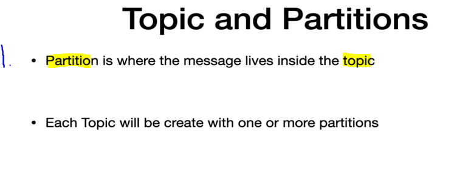
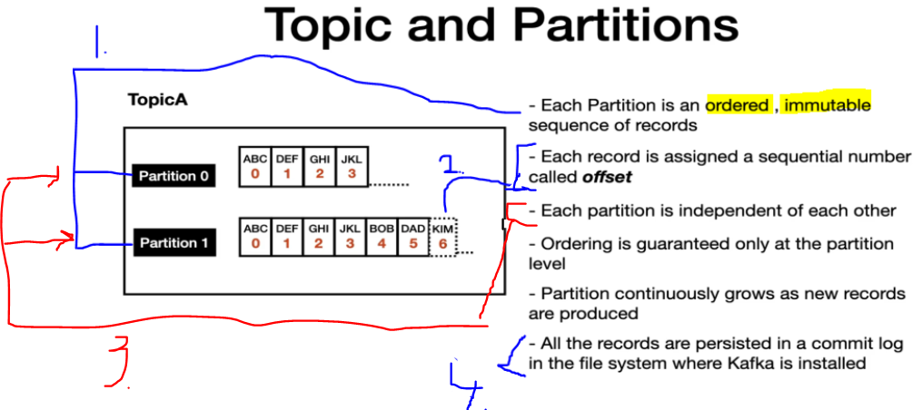
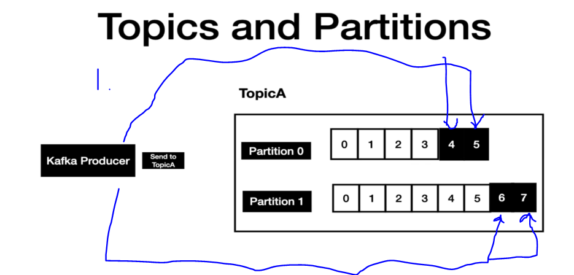
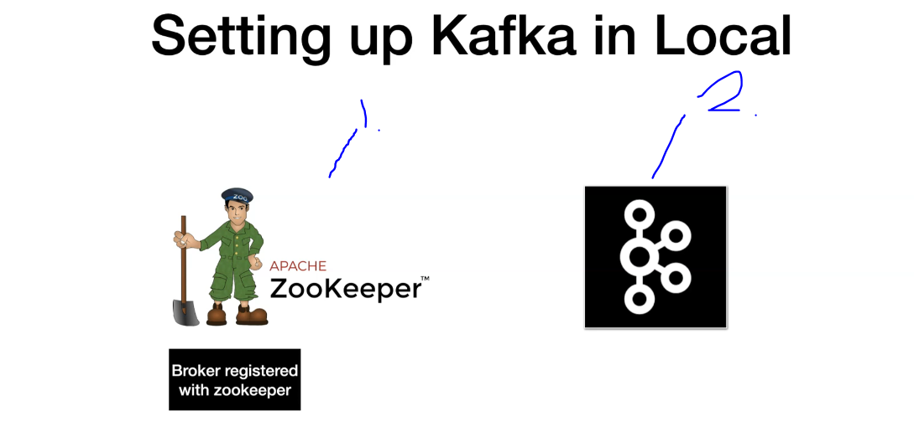
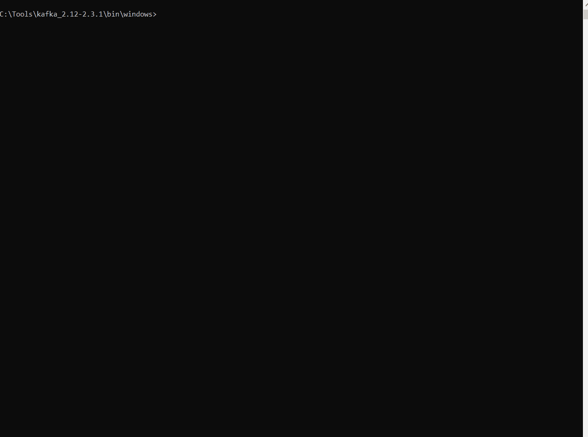

# Section 06: Understanding Kafka Components and its Internals - (Theory + Hands On).

Understanding Kafka Components and its Internals - (Theory + Hands On).

# What I learned.

<div align="center">
    
</div>

1. **Topic** is an Entity, which have a **name** in **Kafka**.
    - Think **Topic** as an table in database like **Entity** Hibernate world.
2. **Topics** mostly live in **Kafka Broker**. Notice the **TopicA** in this example.
    - **Clients** uses the **Topic** name to **produce** and **consume** messages.
3. **Kakfa Consumer** job, is to pull messages from the **Topic**.
    - In this example, **Kafka Consumer** is pulling **Kafka Broker** with the **Topics Name**! 

<div align="center">
    
</div>

1. The **Kafka Producer** job often to **produce** messages into the **Topic**.
    - This usually when, external system invokes the **Kafka Producer**.
    
<div align="center">
    
</div>

1. Message reaches the **Kafka Topic** first. 

2. Once noticed by the **poll**, it will be **consumed** by the **Consumer**. Notice the **message** is still residing **inside topic** for the **retention** time period.

<div align="center">
    
</div>

1. The **message** is located inside the **Partition** and this is resident inside **Topic**. 

<div align="center">
    
</div>

1. **Each partition** is **ordered**, **immutable sequence of records**. Once the **record** is introduced it cannot be changed at all.
2. Each record has **Offset** on it.
    - **Offset** can be used to keep track of the order.
3. The **Partitions** are **independent** of each other! 
4. Records are stored in `.log` file.
    - This is **distributed** log file!

<div align="center">
    
</div>

1. **Kafka Producer** produces messages to the **Partitions**. They get appended to the **appropriate** partition line, at the end!
    - Producer has control, to which **Partition** the message goes.

# SetUp a Zookeeper/Kafka Broker in Local.

- You can check the [Commands](https://github.com/dilipsundarraj1/kafka-for-beginners/blob/master/SetUpKafka.md).

<div align="center">
    
</div>

- We need:
    - `1.` Zookeeper. Think this as **centralized service**.
    - `2.` Kafka Broker.

- We will spin up the **ZooKeeper** and **Kafka**:
    - Once the **Kafka Broker** is started, then it will be registered to the **ZooKeeper**.

- We can check the instruction from [here](https://github.com/dilipsundarraj1/kafka-for-beginners/blob/master/SetUpKafka.md)

> [!IMPORTANT]
> Remember to place the **Kafka** to local drive to prevent the too long character error!

- We are starting the **ZooKeepper** in our local machine!
    - `zookeeper-server-start.bat ..\..\config\zookeeper.properties`.

<div align="center">
    
</div>

- We see that it's running at port `2181`.

- Change the **Broker** configs `server.properties`.

- We need to start the **Broker**.
    - We are starting the **Kafka Broker** with our config files.
        - `kafka-server-start.bat ..\..\config\server.properties`.


   
    <!-- - Check the different **services** `zoo1` and `kafka`. -->

````
version: '2.1'

services:
  zoo1:
    image: confluentinc/cp-zookeeper:7.3.2
    hostname: zoo1
    container_name: zoo1
    ports:
      - "2181:2181"
    environment:
      ZOOKEEPER_CLIENT_PORT: 2181
      ZOOKEEPER_SERVER_ID: 1
      ZOOKEEPER_SERVERS: zoo1:2888:3888


  kafka1:
    image: confluentinc/cp-kafka:7.3.2
    hostname: kafka1
    container_name: kafka1
    ports:
      - "9092:9092"
      - "29092:29092"
    environment:
      KAFKA_ADVERTISED_LISTENERS: INTERNAL://kafka1:19092,EXTERNAL://${DOCKER_HOST_IP:-127.0.0.1}:9092,DOCKER://host.docker.internal:29092
      KAFKA_LISTENER_SECURITY_PROTOCOL_MAP: INTERNAL:PLAINTEXT,EXTERNAL:PLAINTEXT,DOCKER:PLAINTEXT
      KAFKA_INTER_BROKER_LISTENER_NAME: INTERNAL
      KAFKA_ZOOKEEPER_CONNECT: "zoo1:2181"
      KAFKA_BROKER_ID: 1
      KAFKA_OFFSETS_TOPIC_REPLICATION_FACTOR: 1
      KAFKA_TRANSACTION_STATE_LOG_MIN_ISR: 1
      KAFKA_TRANSACTION_STATE_LOG_REPLICATION_FACTOR: 1
    depends_on:
      - zoo1

````

- We will be running the docker images `docker-compose up`.

> [!NOTE]
> Create a **Kafka topic**.

- Create a **Kafka topic** using the **kafka-topics** command:
    - **kafka1:19092** refers to the **KAFKA_ADVERTISED_LISTENERS** in the `docker-compose.yml` file.

- We will be **opening shell** inside **Kafka** container: `docker exec -it kafka1 bash`.

- Then to **Create topic** under the name of the `test-topic`.

````
kafka-topics --bootstrap-server kafka1:19092 \
             --create \
             --topic test-topic \
             --replication-factor 1 --partitions 1
````

> [!NOTE]
> Produce a **Message to the topic**.

> [!NOTE]
> Consume a **Message to the topic**.

> [!NOTE]
> Produce a **Message to the topic**, with **Key** and **Value**.

> [!NOTE]
> Consume a **Message to the topic**, with **Key** and **Value**.

> [!NOTE]
> Consume a **Messages using Consumer Groups**.

> [!NOTE]
> Consume a **Messages With Headers**.


# Set Up a ZooKeeper/Kafka Broker in Local.

# Create Topic, Produce and Consume Messages using the Command Line Interface (CLI).

# Produce and Consume Messages with Key.

# Consumer Offsets.

# Consumer Groups.

# Commit Log and Retention Policy.

# Kafka as a Distributed Streaming System.

# Setting up a Kafka Cluster in Local with 3 Kafka Brokers.

# How Kafka Cluster distributes the Client Requests? - Leader/Follower.

# How Kafka handles Data Loss? - Replication and In-Sync-Replica (ISR).

# Fault Tolerance and Robustness in Kafka.
