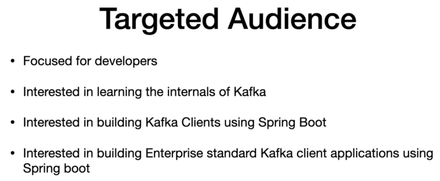
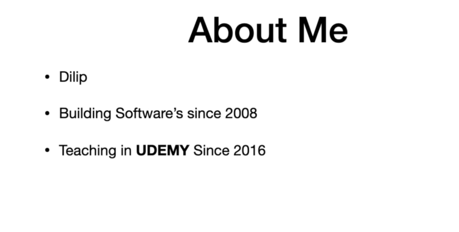
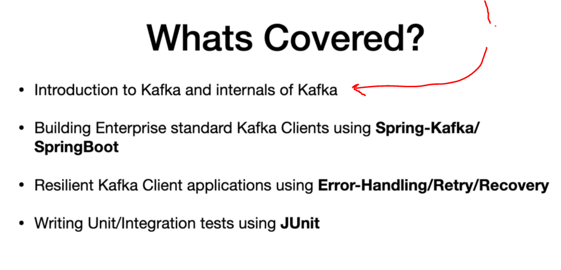
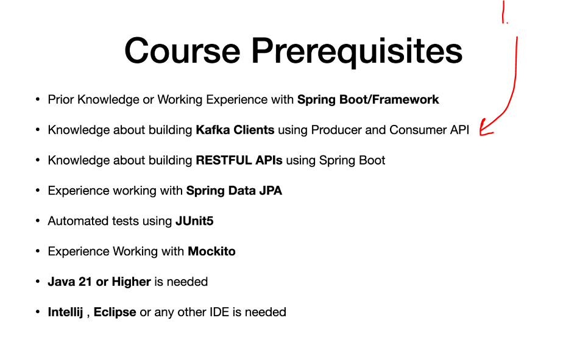

# Section 01: Introduction.

Introduction.

# What I learned.

# Course Introduction & Objectives.

    

    

    

1. Lot of hands on exercises will be made.

# Pre-Requesities.

    

1. This work is considering to be plus.
