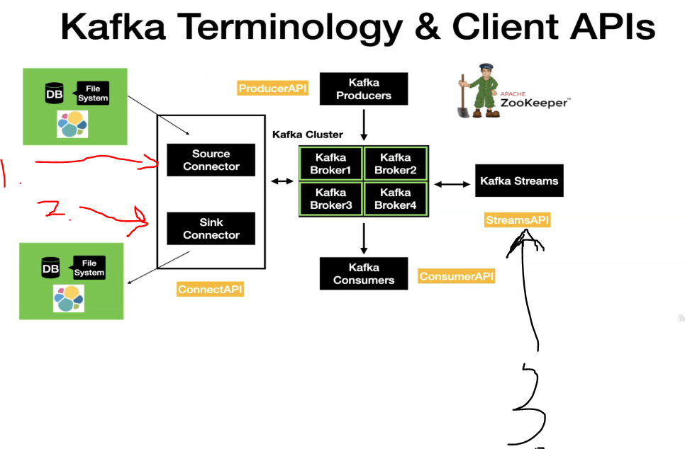

# Section 03: Getting Started with Kafka.

Getting Started with Kafka.

# What I learned.

# Introduction to Kafka.

    

1. In the past there was one monolithic app!
2. Nowadays, there are more **microservices**.
    - Arrows here is communication and looks **spaghetti**!

- There is need to have real-time communication and events.

    

1. This will be used for the **capture**, **store**, **process** and **share** stream of events.

2. Each **Service** will have:
    - **API**.
    - **Event Producer**.
    - **Event Consumer**.
    

    

1. The **Producer** and the **Consumer** are **independent** of each other. **Consumer** does not know of the **Producer**!

2. **Streaming Platform** stores the event of streams. This could be replayed later if needed.

    

1. When message is read by the consumer. The message is removed from the **message broker**.

2. In **Kafka** the events are saved in the file system. Saved time is configurable. This is called **Retention Time**!

3. The **distributed systems** are designed to handle the load **very well** and this gets distributed then the load raises.

    

1. Use case in booking in drives.
    - Real-time tracking of the driver.

- There are other examples as well.

# Kafka Terminologies and Client APIs.

> **Broker** is what the **Kafka Client** will be communicating with.

    

1. In **hearth** there is **Kafka Cluster**.
    - It consists of multiple **Kafka Brokers**.
2. The **ZooKeeper** keeps track of the **brokers** and manages the **Brokers**. 
3. **Kafka Producers** are for introducing new data to the **Kafka**
    - **Client** is going to use the **ProduceAPI** for this task.
4. **Kafka Consumers** are going to be used for consuming **Kafka**.
    - Consumers are going to use the **ConsumerAPI** from the **Kafka Cluster**.

    

1. There are two **Connectors**. First one is the **Source Connector**.
    - This is used to **pull** data form **external** data source. Example database or Elasticsearch.
2. There are two **Connectors**. Second one is the **Sink Connector**.
    - The **Sink** is used for other way around it pushes the data to the **external** data source.  
3. **Kafka Streams** are used **pull** data from the **Kafka** and **performed transformations** from simple to advanced, then putted back into the **Kafka**.