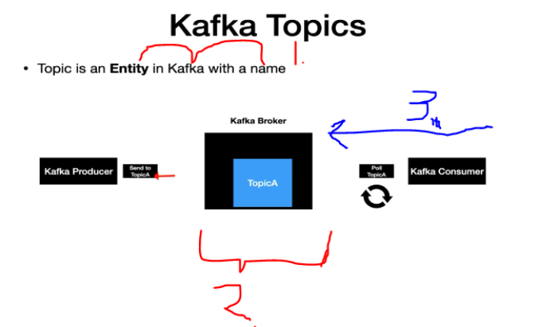
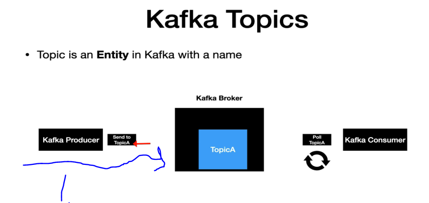
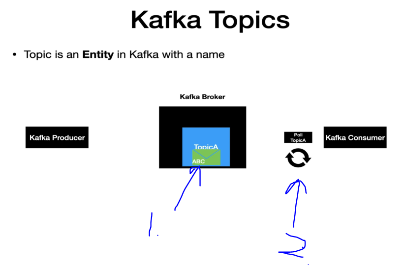
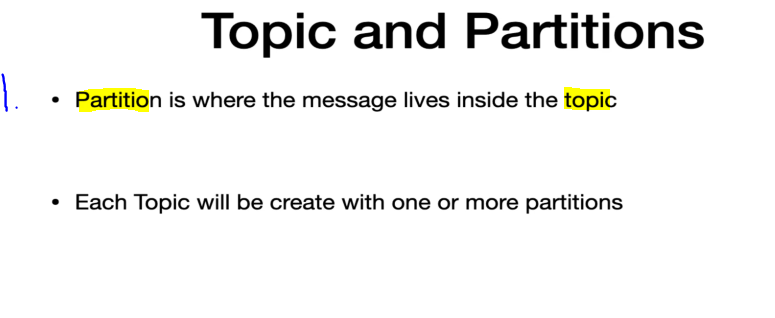
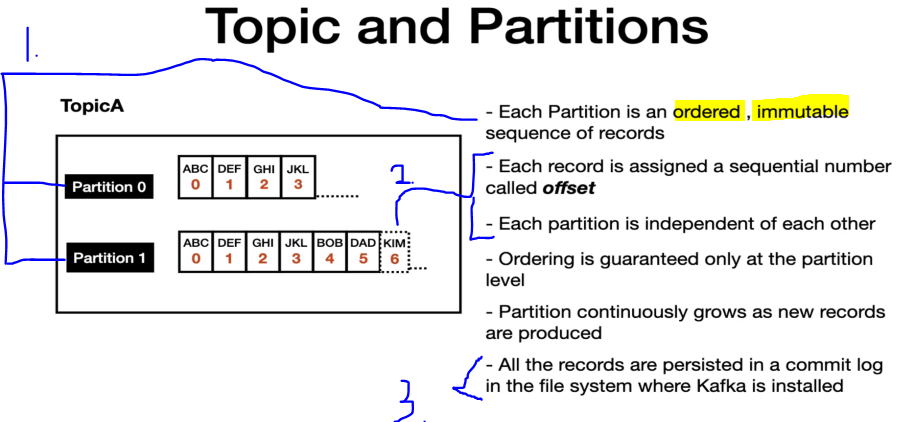
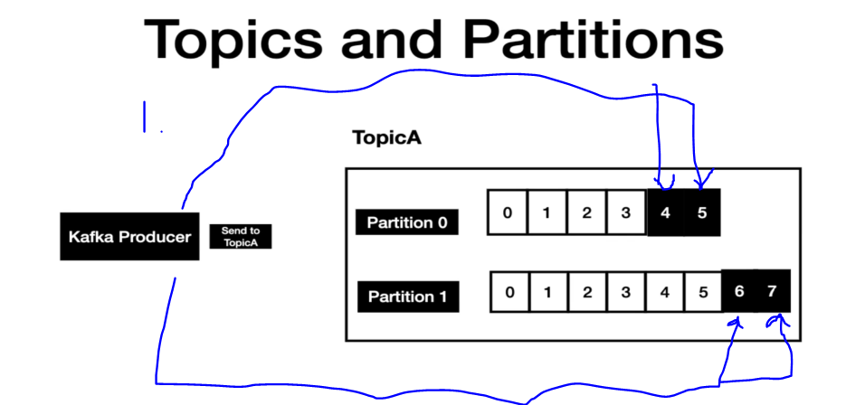
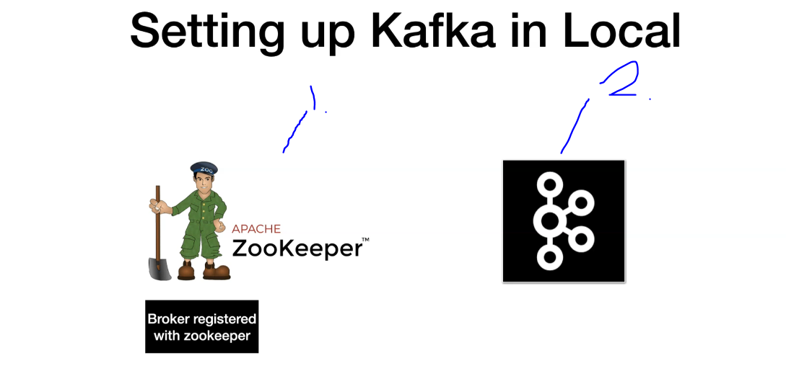

# Section 04: Understanding Kafka Components and its Internals - (Theory + ...).

Understanding Kafka Components and its Internals - (Theory + ...).

# What I learned.

# Kafka Topics and Partitions - Theory.

    

1. **Topic** is an Entity, which have a **name** in **Kafka**.
    - Think **Topic** as an table in database like **Entity** Hibernate world.
2. **Topics** mostly live in **Kafka Broker**. Notice the **TopicA** in this example.
    - **Clients** uses the **Topic** name to **produce** and **consume** messages.
3. **Kakfa Consumer** job, is to pull messages from the **Topic**.
    - In this example, **Kafka Consumer** is pulling **Kafka Broker** with the **Topics Name**! 

    

1. The **Kafka Producer** job often to **produce** messages into the **Topic**.
    - This usually when, external system invokes the **Kafka Producer**.
    

    

1. Message reaches the **Kafka Topic** first. 

2. Once noticed by the **poll**, it will be **consumed** by the **Consumer**. Notice the **message** is still residing **inside topic** for the **retention** time period.

    

1. The **message** is located inside the **Partition** and this is resident inside **Topic**. 

    

1. **Each partition** is **ordered**, **immutable sequence of records**. Once the **record** is introduced it cannot be changed at all.
2. Each record has **Offset** on it.
    - **Offset** can be used to keep track of the order.
3. Stored in `.log` file.

    

1. **Kafka Producer** produces messages to the **Partitions**. They get appended to the appropriate partions line, at the end! 

# SetUp a Zookeeper/Kafka Broker in Local.

- You can check the [Commands](https://github.com/dilipsundarraj1/kafka-for-developers-using-spring-boot-v2/blob/main/SetUpKafkaDocker.md#set-up-broker-and-zookeeper)

    

- We need:
    - `1.` Zookeeper. Think this as **centralized service**.
    - `2.` Kafka Broker.

    - Jäin 2:30