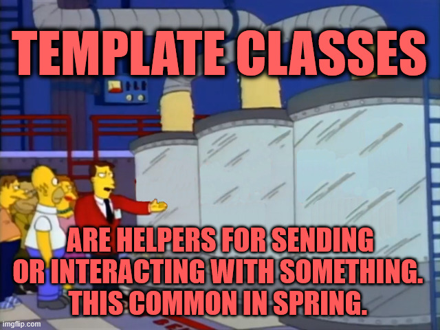

# Section 15: Integration Testing using Embedded Kafka - Kafka Consumer.

Integration Testing using Embedded Kafka - Kafka Consumer.

# What I learned.

# Configure Embedded Kafka for Integration Tests.

- We will be writing **test** for following **Consumer**:

````
package com.learnkafka.consumer;

import com.fasterxml.jackson.core.JsonProcessingException;
import com.learnkafka.service.LibraryEventsService;
import lombok.extern.slf4j.Slf4j;
import org.apache.kafka.clients.consumer.ConsumerRecord;
import org.springframework.beans.factory.annotation.Autowired;
import org.springframework.kafka.annotation.KafkaListener;
import org.springframework.stereotype.Component;

@Component
@Slf4j
public class LibraryEventsConsumer {

    @Autowired
    private LibraryEventsService libraryEventsService;

    @KafkaListener(
            topics = {"library-events"}
            , groupId = "library-events-listener-group")
    public void onMessage(ConsumerRecord<Integer, String> consumerRecord) throws JsonProcessingException {
        log.info("ConsumerRecord : {} ", consumerRecord);
        libraryEventsService.processLibraryEvent(consumerRecord);
    }
}
````

- Todo check this, selvitä mistä tutoriaalista tämä pätkä selvitetään:

````
@SpringBootTest(classes = LibraryEventsConsumerApplication.class)
@EmbeddedKafka(topics = {
        "library-events",
        "library-events.RETRY",
        "library-events.DLT" },
        partitions = 3)
@TestPropertySource(properties = {
        "spring.kafka.producer.bootstrap-servers = ${spring.embedded.kafka.brokers}",
        "spring.kafka.consumer.bootstrap-servers=${spring.embedded.kafka.brokers}",
        "retryListener.startup=false"})
````

- The **test**, which we are writing will be using the:
    -  `@SpringBootTest(classes = LibraryEventsConsumerApplication.class)`.
        - The `@SpringBootTest()` will be starting as in **production**. This will load the:
            - The full Spring context.
            - All beans.
            - The web environment (unless disabled).
            - The configuration.
            - The auto-configuration.
            - The Spring Boot application class.
        - The `classes = LibraryEventsConsumerApplication.class`.
            - Tells the `“Use THIS class as the starting point of the application.”`.
                - This usually needed if the tests are in **non-standard** folder.

> [!NOTE]
> A **Kafka broker** = single running Kafka instance.

- We will be spinning up, in memory **Kafka Embedded Kafka**: 

````
@EmbeddedKafka(topics = {"library-events"
        , "library-events.RETRY"
        , "library-events.DLT"
}
````

- We will be spinning up, with the **Test Properties**, we can use this for **override** application properties for the test class. 
    - `@TestPropertySource(...)`

- For the following fields goes inside **...**.
    - `properties = {"spring.kafka.producer.bootstrap-servers=${spring.embedded.kafka.brokers}"`.
        - Tells to replace following config line: `spring.kafka.producer.bootstrap-servers` inside `.yml`.
            - With following: `${spring.embedded.kafka.brokers}`.
                - `spring.embedded.kafka.brokers` is:
                    - **Auto-created** by `@EmbeddedKafka`.
                    - **Contains** the `host`:`port` of the **embedded Kafka Server**.
                    - Available **ONLY** in the test environment.
                        - **Used** to override your real Kafka settings during tests.


- Currently, the test looks like following: 

````
@SpringBootTest(classes = LibraryEventsConsumerApplication.class)
@EmbeddedKafka(topics = {
        "library-events",
        "library-events.RETRY",
        "library-events.DLT" },
        partitions = 3)
@TestPropertySource(properties = {
        "spring.kafka.producer.bootstrap-servers = ${spring.embedded.kafka.brokers}",
        "spring.kafka.consumer.bootstrap-servers=${spring.embedded.kafka.brokers}",
        "retryListener.startup=false"})
public class LibraryEventsConsumerIntegrationTest
{
... Test code here ...
}
````

- We can **verify**, with actual `IP`:`port` of the **Embedded Kafka Broker** during your test:

````
@Autowired
Environment env;

@Test
void showBrokers() {
    System.out.println(env.getProperty("spring.embedded.kafka.brokers"));
}
````

- The **Environment** is from: `import org.springframework.core.env.Environment;`.

- You can see the assigned **IP:PORT** during the test, from Logs:

````
127.0.0.1:52523
````

- Logging can be seen from the `GIF`:

<div align="center">
    
</div>

> [!TIP]
> **Remember** in Spring prefers using Spring-managed beans in its components. Example of that is using the`@Autowired`.

- We **inject** instance of the `EmbeddedKafkaBroker` into our **test** class for us to use it later. Like in real world cases, this **Kafka Broker** is holding the **Kafka Topics**.
    
````
    @Autowired
    EmbeddedKafkaBroker embeddedKafkaBroker;
````

- For the test we need to configure the **Kafka Producer** and for **Kafka Consumer**:

````
  consumer:
    bootstrap-servers:  localhost:9092,localhost:9093,localhost:9094
    key-deserializer: org.apache.kafka.common.serialization.IntegerDeserializer
    value-deserializer: org.apache.kafka.common.serialization.StringDeserializer
    group-id: library-events-listener-group
  producer:
    bootstrap-servers: localhost:9092,localhost:9093,localhost:9094
    key-serializer: org.apache.kafka.common.serialization.IntegerSerializer
    value-serializer: org.apache.kafka.common.serialization.StringSerializer
````

> We need to provide these **serializers** so that every message `value` or `key` you send is a **converted** appropriately, since **Kafka** is NOT aware of Java types.

- Here, we are providing the **Kafka** the configurations that it will need for the deserialization and serialization.
  - **Producer** serializers:
    - `IntegerSerializer` → convert **Integer** into **bytes**.
    - `StringSerializer` → convert **String** into **bytes**.
  - **Consumer** deserializers:
    - `IntegerDeserializer` → convert **bytes** back into **Integer**.
    - `StringDeserializer` → convert **bytes** back into **String**.

<div align="center">
    
</div>

- There is some `Template` examples:
    - `JdbcTemplate` Execute **SQL** queries on a relational database.
    - `RestTemplate` Send HTTP requests to **REST** endpoints.
        - You can see one example of such choice [here](https://github.com/developersCradle/springboot-microservices/tree/main?tab=readme-ov-file#architecture-explanation).
    - `KafkaTemplate` Send messages to **Kafka** topics.
    - `JmsTemplate` Send and receive messages via **JMS**.
    - `RabbitTemplate` Send and receive messages via **RabbitMQ**.

> [!NOTE]
> This is no different in **Kafka** as well see the → `KafkaTemplate`.

````
@Autowired
KafkaTemplate<Integer, String> kafkaTemplate;
````

- The **KafkaTempate** makes sending **Kafka** messages much simpler, see below:
    - The without **KafkaTemplate**, we need to write a lot of **boiler code**:
    ````
    Properties props = new Properties();
    props.put("bootstrap.servers", "localhost:9092");
    props.put("key.serializer", IntegerSerializer.class.getName());
    props.put("value.serializer", StringSerializer.class.getName());

    Producer<Integer, String> producer = new KafkaProducer<>(props);
    producer.send(new ProducerRecord<>("test-topic", 1, "Hello"));
    producer.close();
    ````
    - The with The **KafkaTemplate**:
    ````
    @Autowired
    KafkaTemplate<Integer, String> kafkaTemplate;

    kafkaTemplate.send("test-topic", 1, "Hello Kafka!");
    ````

- Configuring the point to which topic the **message** is sent to! The **template** will be used for sending the messages.

````
spring:
  kafka:
    template:
      default-topic: library-events
````

- We need to have way to check that **Kafka** is setted correctly.
````
    @BeforeEach
    void setUp() {
        for (MessageListenerContainer messageListenerContainer : endpointRegistry.getListenerContainers()) {
            ContainerTestUtils.waitForAssignment(messageListenerContainer, embeddedKafkaBroker.getPartitionsPerTopic());
        }
    }
````

- The `KafkaListenerEndpointRegistry` holds the **listener containers**.
  - Todo selvitä tämö
````
    @Autowired
    KafkaListenerEndpointRegistry endpointRegistry;
````


<details>
<summary id="IDE problem" open="false">Full configuration for these <b>Kafka</b> <code>application.yml</code>.</summary>

````
spring:
  profiles:
    active: local
server:
  port: 8081
---

# For the local!

spring:
  config:
    activate:
      on-profile: local
  kafka:
    template:
      default-topic: library-events
    consumer:
      bootstrap-servers:  localhost:9092,localhost:9093,localhost:9094
      key-deserializer: org.apache.kafka.common.serialization.IntegerDeserializer
      value-deserializer: org.apache.kafka.common.serialization.StringDeserializer
      group-id: library-events-listener-group
    producer:
      bootstrap-servers: localhost:9092,localhost:9093,localhost:9094
      key-serializer: org.apache.kafka.common.serialization.IntegerSerializer
      value-serializer: org.apache.kafka.common.serialization.StringSerializer
  datasource:
    url: jdbc:h2:mem:testdb
    driver-class-name: org.h2.Driver
  jpa:
    database: h2
    database-platform: org.hibernate.dialect.H2Dialect
    generate-ddl: true
  h2:
    console:
      enabled: true
---

# For the non-production!

spring:
  config:
    activate:
      on-profile: nonprod
  kafka:
    consumer:
      bootstrap-servers: nonprod:9092,nonprod:9093,nonprod:9094
      key-deserializer: org.apache.kafka.common.serialization.IntegerDeserializer
      value-deserializer: org.apache.kafka.common.serialization.StringDeserializer
````
</schema>
</details>


# Write the Integration test for posting a "NEW" LibraryEvent.


# Write the Integration test for posting a "UPDATE" LibraryEvent.


# Write the Integration test for posting an invalid UPDATE LibraryEvent.


# Integration Tests for Real Databases using TestContainers.
