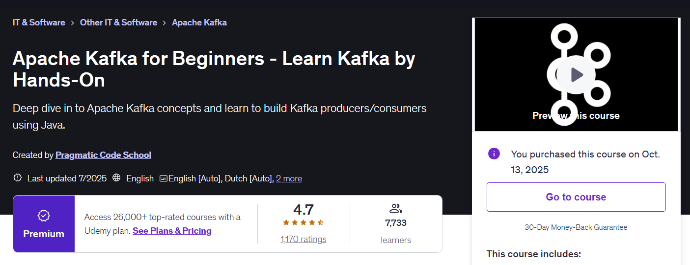
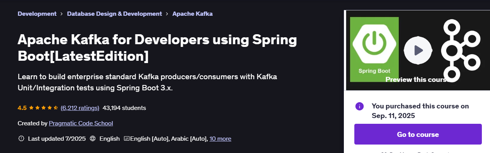
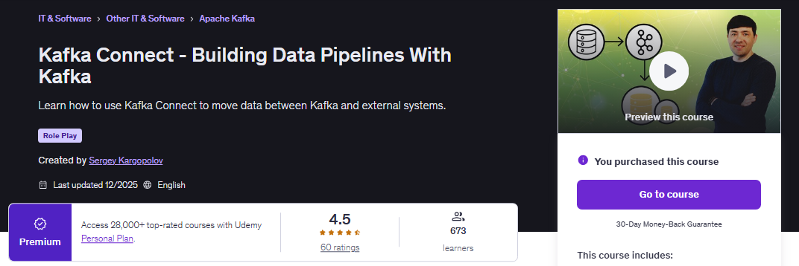
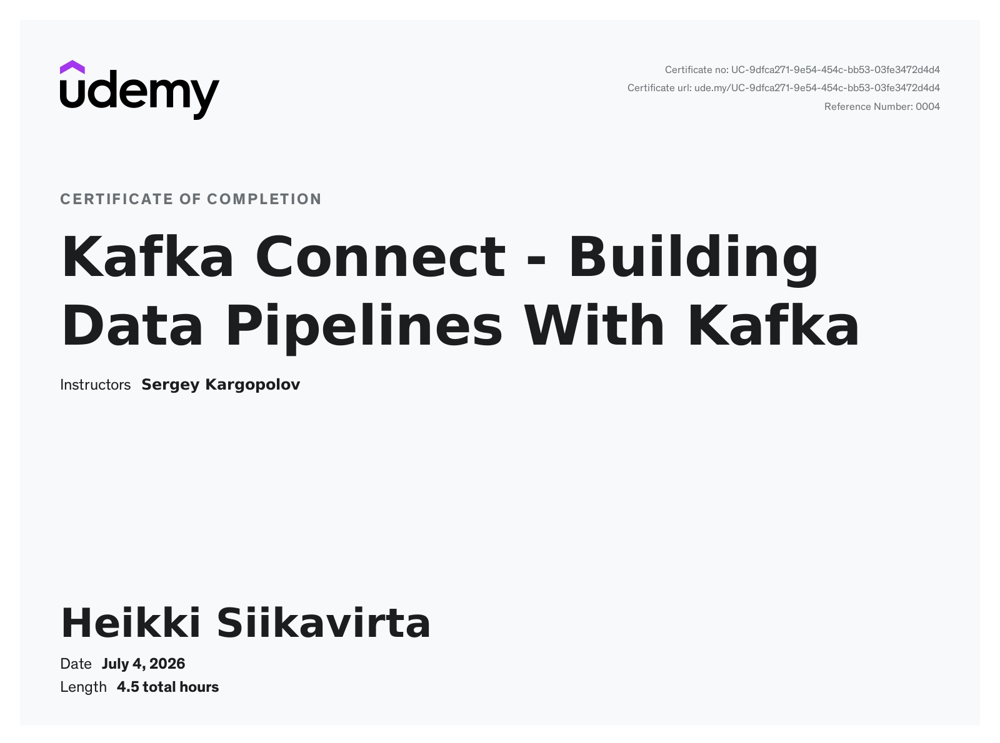

<!-- 
We are using following structure:

<p align="center">
    
</p> 
<p align="center">
    
</p>
-->

<!--
Template for the questions:

# Quiz 07: Atomic Operations, Volatile & Metrics Practical Example.

<details>
<summary id="Question_01" open="true"> <b>Question 01.</b> </summary>
````yaml
Question 01:
The question comes here!

- My answer:

<div align="center">
    
</div>

1. Add here the answer!

</details>
-->

<!-- 
Template for the task/exercies:
 
# Lab Exercise - Mapping Collections of Value Types.

<div align="center">
    
</div>

1. **Question 1:** add here the question from the test!
	- **Answer:** **D**. here can be the examplaniton!
 -->

<p align="center">
    
</p>

- For these courses one should configure **GIT** for handle projects.
    - `git config --global http.postBuffer 524288000`.
    - `git config --global core.longpaths true`.

<details>

<summary id="Kafka the progress" open="true"> <b>Kafka course map!</b> </summary>

<br>

<p align="center">
    
</p>

1. You can take this course first: [Apache Kafka for Beginners - Learn Kafka by Hands-On](https://www.udemy.com/course/apache-kafka-deep-dive-hands-on-using-javabuilt-in-scripts/).
2. You can take the this course second: [Apache Kafka for Developers using Spring Boot LatestEdition](https://www.udemy.com/course/apache-kafka-for-developers-using-springboot/?).

<!-- todo check this one, if this is meaningfull! -->

</details>

<p align="center">
    
</p> 
<p align="center">
    
</p>


All course material from *Apache Kafka for Beginners Learn Kafka by Hands On*
by **Pragmatic Code School** ©. 

> I was faced with speedy deadlines for integrating crucial bank connections. During testing, some of the embedded Kafka test pieces were behaving strangely, and messages weren’t being consumed as expected. 🐟
>
> Thankfully, a recent course I had taken proved crucial. It helped me pinpoint subtle serialization issues in the Kafka workflows. 🐟<br><br> ~ *DevelopersCradle*

Contains my own notes with some course material to enforce learning experience.

This repository is made with [](#) with [](#) hotkeys, therefore it will include configuration files which are related to this IDE this approach will be favored for now. ⚙️

Also, the course projects are migrated to the use the  since I am more familiar with it.

[The course at Udemy](https://www.udemy.com/course/apache-kafka-deep-dive-hands-on-using-javabuilt-in-scripts/). 

If the content sparked :fire: your interest, please consider buying the course and start learning :book:.

<!-- 
Linkedin puts this shit front, when clicking from private mode x(. Need to put this to make jump working every case
?trk=public_profile_see-credential 
-->

<div align="center">
    Insert certificate here when completed
</div>

**Note: The material provided in this repository is only for helping those who may get stuck at any point of time in the course. It is very advised that no one should just copy the solutions(violation of Honor Code) presented here.**

#### Progress/Curriculum.

- [x] [Section 01](https://github.com/developersCradle/kafka-spring-boot/tree/main/Apache%20Kafka%20for%20Beginners%20Learn%20Kafka%20by%20Hands%20On/Section%2001#section-01-introduction) - Getting Started with Course. ✅
- [x] [Section 02](https://github.com/developersCradle/kafka-spring-boot/blob/main/Apache%20Kafka%20for%20Beginners%20Learn%20Kafka%20by%20Hands%20On/Section%2002/README.md#section-02-course-slides) - Course Slides. ✅
- [x] [Section 03](https://github.com/developersCradle/kafka-spring-boot/tree/main/Apache%20Kafka%20for%20Beginners%20Learn%20Kafka%20by%20Hands%20On/Section%2003#section-03-getting-started-with-kafka) - Getting Started with Kafka. ✅
- [x] [Section 04](https://github.com/developersCradle/kafka-spring-boot/tree/main/Apache%20Kafka%20for%20Beginners%20Learn%20Kafka%20by%20Hands%20On/Section%2004#section-04-download-and-install-kafka) - Download and Install Kafka. ✅
- [x] [Section 05](https://github.com/developersCradle/kafka-spring-boot/blob/main/Apache%20Kafka%20for%20Beginners%20Learn%20Kafka%20by%20Hands%20On/Section%2005/README.md#section-05-source-code-for-this-course) - Source Code for this Course. ✅
- [ ] [Section 06](https://github.com/developersCradle/kafka-spring-boot/tree/main/Apache%20Kafka%20for%20Beginners%20Learn%20Kafka%20by%20Hands%20On/Section%2006#section-06-understanding-kafka-components-and-its-internals---theory--hands-on) - Understanding Kafka Components and its Internals - (Theory + Hands On). ⚠️ In progress! ⚠️
- [ ] [Section 07](https://github.com/developersCradle/kafka-spring-boot/tree/main/Apache%20Kafka%20for%20Beginners%20Learn%20Kafka%20by%20Hands%20On/Section%2007#section-07-kafka-producer-api---hands-on) - Kafka Producer API - Hands On. ⚠️ In progress! ⚠️
- [ ] [Section 08](https://github.com/developersCradle/kafka-spring-boot/tree/main/Apache%20Kafka%20for%20Beginners%20Learn%20Kafka%20by%20Hands%20On/Section%2008#section-08-kafka-producer-api---guaranteed-message-delivery-configurations) - Kafka Producer API - Guaranteed Message Delivery Configurations. ⚠️ In progress! ⚠️
- [ ] [Section 09](https://github.com/developersCradle/kafka-spring-boot/tree/main/Apache%20Kafka%20for%20Beginners%20Learn%20Kafka%20by%20Hands%20On/Section%2009#section-09-kafka-consumer-api---hands-on) - Kafka Consumer API - Hands On. ⚠️ In progress! ⚠️
- [ ] [Section 10](https://github.com/developersCradle/kafka-spring-boot/tree/main/Apache%20Kafka%20for%20Beginners%20Learn%20Kafka%20by%20Hands%20On/Section%2010#section-10-consumer-groups--consumer-rebalance---hands-on) - Consumer Groups & Consumer Rebalance - Hands On. ⚠️ In progress! ⚠️
- [ ] [Section 11](https://github.com/developersCradle/kafka-spring-boot/tree/main/Apache%20Kafka%20for%20Beginners%20Learn%20Kafka%20by%20Hands%20On/Section%2011#section-11-consumer-offsets---default-and-manual-offset-management---hands-on) - Consumer Offsets - Default and Manual Offset Management - Hands On. ⚠️ In progress! ⚠️
- [ ] [Section 12](https://github.com/developersCradle/kafka-spring-boot/tree/main/Apache%20Kafka%20for%20Beginners%20Learn%20Kafka%20by%20Hands%20On/Section%2012#section-12-consumer-rebalance-listeners---hands-on) - Consumer Rebalance Listeners - Hands On. ⚠️ In progress! ⚠️
- [ ] [Section 13](#) - Kafka Consumer - seekToBeginning(), seekToEnd() & seek() - Hands On. ⚠️ In progress! ⚠️
- [ ] [Section 14](https://github.com/developersCradle/kafka-spring-boot/tree/main/Apache%20Kafka%20for%20Beginners%20Learn%20Kafka%20by%20Hands%20On/Section%2014#section-14-custom-serializer-and-deserializers-in-kafka---hands-on) - Custom Serializer and Deserializers in Kafka - Hands On. ⚠️ In progress! ⚠️
- [ ] [Section 15](#) - Bonus Section. ⚠️ In progress! ⚠️

#### Additional stuff.

- [ ] Migrate all projects into Maven projects.
- [x] The repository for the code is [here](https://github.com/dilipsundarraj1/kafka-for-beginners). ✅
- [ ] Check the running with the `.sh` in widows `ZooKeepper` and the Kafka server.

<p align="center">
    
</p> 
<p align="center">
    
</p>

All course material from *Apache Kafka for Developers using Spring Boot*
by **Pragmatic Code School** ©. 

> A tight delivery schedule forced me to integrate several critical banking streams in record time. While running the tests, the embedded Kafka setup began acting unpredictably—messages vanished, consumers stalled, and nothing made sense at first. 🐟
>
> Luckily, I had completed a training not long before, and one of its modules clicked immediately. It guided me straight to the root cause: a hidden mismatch in the Kafka serialization layer that was quietly breaking the entire flow.🐟 <br><br> ~ DevelopersCradle

Contains my own notes with some course material to enforce learning experience.

This repository is made with [](#) with [](#) hotkeys, therefore it will include configuration files which are related to this IDE this approach will be favored for now. ⚙️

Also, the course projects are migrated to the use the  since I am more familiar with it.

[The course at Udemy](https://www.udemy.com/course/apache-kafka-for-developers-using-springboot/). 


If the content sparked :fire: your interest, please consider buying the course and start learning :book:.

<!-- 
Linkedin puts this shit front, when clicking from private mode x(. Need to put this to make jump working every case
?trk=public_profile_see-credential 
-->

<div align="center">
    Insert certificate here when completed
</div>


**Note: The material provided in this repository is only for helping those who may get stuck at any point of time in the course. It is very advised that no one should just copy the solutions(violation of Honor Code) presented here.**

#### Progress/Curriculum.

- [x] [Section 01](https://github.com/developersCradle/kafka-spring-boot/tree/main/Apache%20Kafka%20for%20Developers%20using%20Spring%20Boot/Section%2001#section-01-introduction) - Getting Started With the Course. ✅
- [x] [Section 02](https://github.com/developersCradle/kafka-spring-boot/tree/main/Apache%20Kafka%20for%20Developers%20using%20Spring%20Boot/Section%2002) - Course Slides. ✅
- [x] [Section 03](https://github.com/developersCradle/kafka-spring-boot/blob/main/Apache%20Kafka%20for%20Developers%20using%20Spring%20Boot/Section%2003/README.md#section-03-getting-started-with-kafka) - Getting Started with Kafka. ✅
- [ ] [Section 04](https://github.com/developersCradle/kafka-spring-boot/blob/main/Apache%20Kafka%20for%20Developers%20using%20Spring%20Boot/Section%2004/README.md#section-04-understanding-kafka-components-and-its-internals---theory--) - Understanding Kafka Components and its Internals - (Theory + ...). ⚠️ In progress! ⚠️
- [ ] [Section 05](#) - Application Overview. ⚠️ In progress! ⚠️
- [ ] [Section 06](#) - Source Code for this Course. ⚠️ In progress! ⚠️
- [ ] [Section 07](#) - Build SpringBoot Kafka Producer - Hands On. ⚠️ In progress! ⚠️
- [ ] [Section 08](#) - Integration Testing using JUnit5 - Hands On. ⚠️ In progress! ⚠️
- [ ] [Section 09](#) - Unit Testing using JUnit5 - Hands On. ⚠️ In progress! ⚠️
- [ ] [Section 10](#) - Kafka Producer - Sending Message With Key - Hands On. ⚠️ In progress! ⚠️
- [ ] [Section 11](#) - Kafka Producer - Important Configurations. ⚠️ In progress! ⚠️
- [ ] [Section 12](#) - Build SpringBoot Kafka Consumer - Hands On. ⚠️ In progress! ⚠️
- [ ] [Section 13](#) - Consumer Groups and Consumer Offset Management - Hands On. ⚠️ In progress! ⚠️
- [ ] [Section 14](#) - Persisting Library Events in DB - Using H2 InMemory Database. ⚠️ In progress! ⚠️
- [ ] [Section 15](https://github.com/developersCradle/kafka-spring-boot/tree/main/Apache%20Kafka%20for%20Developers%20using%20Spring%20Boot/Section%2015#section-15-integration-testing-using-embedded-kafka---kafka-consumer) - Integration Testing using Embedded Kafka - Kafka Consumer. ⚠️ In progress! ⚠️
- [ ] [Section 16](#) - Error Handling, Retry and Recovery - Kafka Consumers. ⚠️ In progress! ⚠️
- [ ] [Section 17](#) - Error Handling, Retry and Recovery - Kafka Producer. ⚠️ In progress! ⚠️
- [ ] [Section 18](#) - Kafka Security using SSL - Hands On. ⚠️ In progress! ⚠️
- [ ] [Section 19](#) - Accessing SSL Secured Kafka Cluster using Spring Boot. ⚠️ In progress! ⚠️

#### Additional stuff.

- [ ] `Integration Testing using Embedded Kafka - Kafka Consumer` do this for now.
- [ ] Do the `CountDownLatch` that is related to **Threads**. This is related to the `Integration Testing using Embedded Kafka - Kafka Consumer`.
    - Do the [chapters](https://github.com/developersCradle/data-structures-algorithms-and-java-multithreading-concurrency-performance-optimization/tree/main/Java%20Multithreading%2C%20Concurrency%20%26%20Performance%20Optimization/Section%2008#chapter-08---inter-thread-communication).
- [ ] Get know of the Publish–Subscribe (pub/sub) model. Since this is related to Kafka.    
- [x] The repository for the code is [here](https://github.com/dilipsundarraj1/kafka-for-developers-using-spring-boot-v2). ✅
- [x] The commands, which are used in this course. [Here](https://github.com/dilipsundarraj1/kafka-for-developers-using-spring-boot-v2/blob/main/SetUpKafkaDocker.md#set-up-broker-and-zookeeper). ✅

<!-- 
<p align="center">
    
</p>  -->

# Kafka Connect - Building Data Pipelines With Kafka.

<p align="center">
    
</p>

All course material from *Kafka Connect - Building Data Pipelines With Kafka* by **Sergey Kargopolov** ©. 


> At 🏛️**Nordea**🏛️, we were integrating the **G**roup **KYC** (**GKYC**) platform with several downstream applications through Kafka. The messages published by **GKYC** couldn't be consumed directly by every system. Different consumers required different message formats—some needed fields to be renamed, others required certain attributes to be removed, and a few expected additional metadata before processing the events. 🐟
>
> Our first instinct was to build a dedicated transformation microservice. However, that would have meant introducing another component to develop, deploy, monitor, and maintain. 🐟
>
> A recent course I had taken on *Kafka Connect: Building Data Pipelines with Kafka* proved incredibly useful. It showed how to leverage Kafka Connect **S**ingle **M**essage **T**ransforms (**SMT**s) to perform message transformations directly within the connector. Instead of writing custom code, we configured transformations to rename fields, drop sensitive information, add static values, and reshape the **GKYC** events before they reached the target systems. 🐟
>
> By keeping these transformations inside **Kafka Connect**, we reduced operational complexity, eliminated an unnecessary service, and made it much easier to adapt when new consumers with different requirements were introduced. 🐟 <br><br> ~ DevelopersCradle

Contains my own notes with some course material to enforce learning experience.

This repository is made with [](#) with [](#) hotkeys, therefore it will include configuration files which are related to this IDE this approach will be favored for now. ⚙️

Also, the course projects are migrated to the use the  since I am more familiar with it.

[The course at Udemy](https://www.udemy.com/course/kafka-connect-building-data-pipelines-with-kafka). 
[Content maker](https://www.appsdeveloperblog.com/).


If the content sparked :fire: your interest, please consider buying the course and start learning :book:.

<!-- 
Linkedin puts this shit front, when clicking from private mode x(. Need to put this to make jump working every case
?trk=public_profile_see-credential 
-->


<p align="center">
    
</div>


**Note: The material provided in this repository is only for helping those who may get stuck at any point of time in the course. It is very advised that no one should just copy the solutions(violation of Honor Code) presented here.**

#### Progress/Curriculum.

- [ ] [Section 01](#) - Introduction
- [ ] [Section 02](#) - Software
- [ ] [Section 03](#) - Apache Kafka Cluster
- [ ] [Section 04](#) - Kafka Connect Connectors
- [ ] [Section 05](#) - Kafka Connect Standalone mode - Using CLI scripts
- [ ] [Section 06](#) - Kafka Connect Standalone mode - In Docker container
- [ ] [Section 07](#) - Kafka Connect Cluster in Distributed Mode using CLI
- [ ] [Section 08](#) - Managing Kafka Connect Cluster running in Distributed mode with REST API
- [ ] [Section 09](#) - Kafka Connect Cluster in Distributed Mode with Docker

#### Additional stuff.

- [ ] todo.
